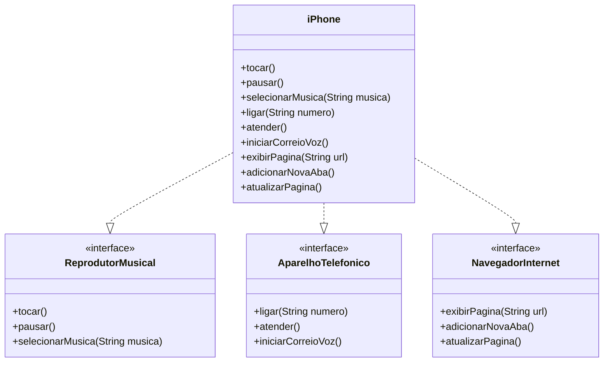

<<<<<<< HEAD
# [DIO](www.dio.me) - Trilha Java Básico

## POO - Desafio

### Modelagem e Diagramação de um Componente iPhone

Neste desafio, você será responsável por modelar e diagramar a representação UML do componente iPhone(com base no vídeo de lançamento do iPhone de 2007), abrangendo suas funcionalidades como Reprodutor Musical, Aparelho Telefônico e Navegador na Internet.

#### Funcionalidades a Modelar
1. **Reprodutor Musical**
   - Métodos: `tocar()`, `pausar()`, `selecionarMusica(String musica)`
2. **Aparelho Telefônico**
   - Métodos: `ligar(String numero)`, `atender()`, `iniciarCorreioVoz()`
3. **Navegador na Internet**
   - Métodos: `exibirPagina(String url)`, `adicionarNovaAba()`, `atualizarPagina()`

### Objetivo
1. Criar um diagrama UML que represente as funcionalidades descritas acima.
2. Implementar as classes e interfaces correspondentes em Java (Opcional).

### Diagrama UML (Mermaid)


### Implementação

```java
// src/aparelho/funcionalidades
// ReprodutorMusical.java
public interface ReprodutorMusical {
  void tocar();
  void pausar();
  void selecionarMusica(String musica);
}

// src/aparelho/funcionalidades
// AparelhoTelefonico.java
public interface AparelhoTelefonico {
  void ligar(String numero);
  void atender();
  void iniciarCorreioVoz();
}

// src/aparelho/funcionalidades
// NavegadorInternet.java
public NavegadorInternet {
  void exibirPagina(String url);
  void adicionarNovaAba();
  void atualizarPagina();
}

// src/aprelho
// iPhone.java
public class iPhone implements ReprodutorMusical, AparelhoTelefonico, NavegadorInterntet {
  //ReprodutorMusical
  @Override
  public void tocar() {
    System.out.println("Reproduzindo música!");
  }

  @Override
  public void pausar() {
    System.out.println("Música pausada.");
  }

 @Override
  public void selecionarMusica(String musica) {
    System.out.println("Música selecionada: " + musica);
  }

//Aparelhotelefonico
 @Override
  public void ligar(String numero) {
    System.out.println("Lingando: " + numero);
  }

 @Override
  public void atender() {
    System.out.println("Atendendo chamada");
  }

 @Override
  public void iniciarCorreioVoz() {
    System.out.println("Iniciando correio de voz");
  }

//NavegadorInternet
 @Override
  public void exibirPagina(String url) {
    System.out.println("Exibindo página: " + url);
  }

 @Override
  public void adicionarNovaAba() {
    System.out.println("Nova aba adicionada");
  }

 @Override
  public void atualizarPagina() {
    System.out.println("Página atualizada!");
  }
}

```